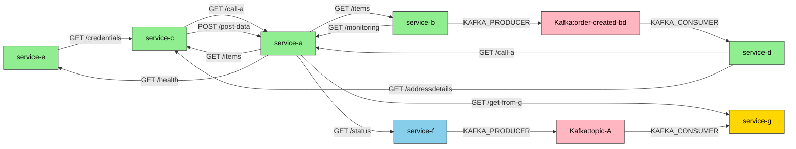

```mermaid
graph LR
classDef First_project fill:#90EE90,stroke:#333,color:#000
classDef Kafka fill:#FFB6C1,stroke:#333,color:#000
classDef Repo-1 fill:#87CEEB,stroke:#333,color:#000
classDef Repo-2 fill:#FFD700,stroke:#333,color:#000
  service-e -->|GET /credentials| service-c
  service-d -->|GET /call-a| service-a
  service-d -->|GET /addressdetails| service-c
  Kafka:order-created-bd -->|KAFKA_CONSUMER| service-d
  service-a -->|GET /items| service-b
  service-a -->|GET /items| service-c
  service-a -->|GET /health| service-e
  service-a -->|GET /get-from-g| service-g
  service-a -->|GET /status| service-f
  service-c -->|GET /call-a| service-a
  service-c -->|POST /post-data| service-a
  service-b -->|GET /monitoring| service-a
  service-b -->|KAFKA_PRODUCER| Kafka:order-created-bd
  Kafka:topic-A -->|KAFKA_CONSUMER| service-g
  service-f -->|KAFKA_PRODUCER| Kafka:topic-A
class service-e,service-d,service-a,service-c,service-b First_project
class Kafka:order-created-bd,Kafka:topic-A Kafka
class net8.0,service-f Repo-1
class service-g Repo-2
```