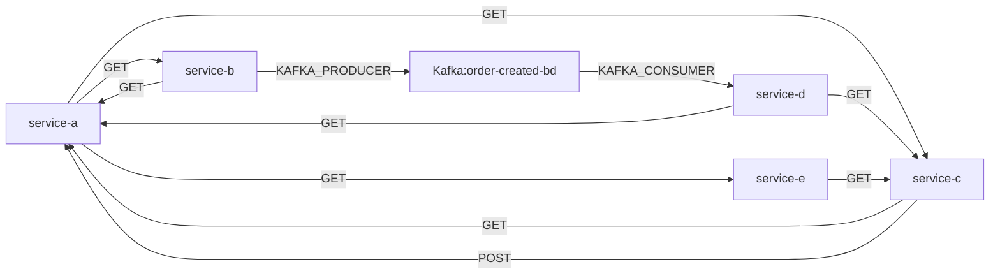

```mermaid
graph LR
  service-a -->|GET| service-b
  service-a -->|GET| service-c
  service-a -->|GET| service-e
  service-b -->|GET| service-a
  service-b -->|KAFKA_PRODUCER| Kafka:order-created-bd
  service-c -->|GET| service-a
  service-c -->|POST| service-a
  service-d -->|GET| service-a
  service-d -->|GET| service-c
  Kafka:order-created-bd -->|KAFKA_CONSUMER| service-d
  service-e -->|GET| service-c
```