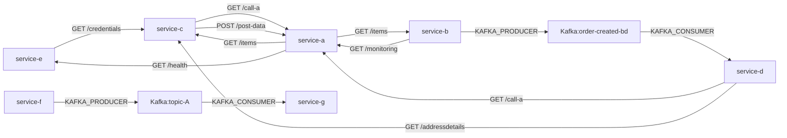

```mermaid
graph LR
  service-e -->|GET /credentials| service-c
  service-d -->|GET /call-a| service-a
  service-d -->|GET /addressdetails| service-c
  Kafka:order-created-bd -->|KAFKA_CONSUMER| service-d
  service-a -->|GET /items| service-b
  service-a -->|GET /items| service-c
  service-a -->|GET /health| service-e
  service-c -->|GET /call-a| service-a
  service-c -->|POST /post-data| service-a
  service-b -->|GET /monitoring| service-a
  service-b -->|KAFKA_PRODUCER| Kafka:order-created-bd
  Kafka:topic-A -->|KAFKA_CONSUMER| service-g
  service-f -->|KAFKA_PRODUCER| Kafka:topic-A
```