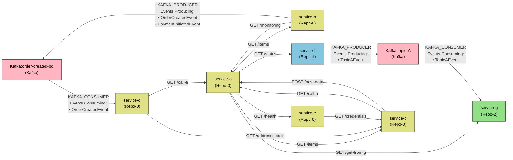

```mermaid
graph LR
classDef Kafka fill:#FFB6C1,stroke:#333,color:#000
classDef Repo_0 fill:#E0E084,stroke:#333,color:#000
classDef Repo_1 fill:#84C5E0,stroke:#333,color:#000
classDef Repo_2 fill:#90E084,stroke:#333,color:#000

  Kafka_order_created_bd["Kafka:order-created-bd
(Kafka)"]
  Kafka_topic_A["Kafka:topic-A
(Kafka)"]
  service_a["service-a
(Repo-0)"]
  service_b["service-b
(Repo-0)"]
  service_c["service-c
(Repo-0)"]
  service_d["service-d
(Repo-0)"]
  service_e["service-e
(Repo-0)"]
  service_f["service-f
(Repo-1)"]
  service_g["service-g
(Repo-2)"]

  service_a -->|GET /items| service_b
  service_a -->|GET /items| service_c
  service_a -->|GET /health| service_e
  service_a -->|GET /get-from-g| service_g
  service_a -->|GET /status| service_f
  service_b -->|GET /monitoring| service_a
  service_c -->|GET /call-a| service_a
  service_c -->|POST /post-data| service_a
  service_d -->|GET /call-a| service_a
  service_d -->|GET /addressdetails| service_c
  service_e -->|GET /credentials| service_c
  service_b -->|"KAFKA_PRODUCER<br/>Events Producing:<br/>• OrderCreatedEvent<br/>• PaymentInitiatedEvent"| Kafka_order_created_bd
  Kafka_order_created_bd -->|"KAFKA_CONSUMER<br/>Events Consuming:<br/>• OrderCreatedEvent"| service_d
  service_f -->|"KAFKA_PRODUCER<br/>Events Producing:<br/>• TopicAEvent"| Kafka_topic_A
  Kafka_topic_A -->|"KAFKA_CONSUMER<br/>Events Consuming:<br/>• TopicAEvent"| service_g

class Kafka_order_created_bd,Kafka_topic_A Kafka
class service_a,service_b,service_c,service_d,service_e Repo_0
class service_f Repo_1
class service_g Repo_2
```