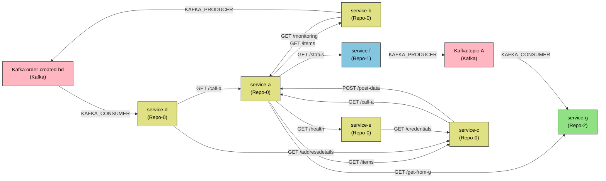

```mermaid
graph LR
classDef Kafka fill:#FFB6C1,stroke:#333,color:#000
classDef Repo-0 fill:#E0E084,stroke:#333,color:#000
classDef Repo-1 fill:#84C5E0,stroke:#333,color:#000
classDef Repo-2 fill:#90E084,stroke:#333,color:#000

  Kafka:order-created-bd["Kafka:order-created-bd
(Kafka)"]
  Kafka:topic-A["Kafka:topic-A
(Kafka)"]
  service-a["service-a
(Repo-0)"]
  service-b["service-b
(Repo-0)"]
  service-c["service-c
(Repo-0)"]
  service-d["service-d
(Repo-0)"]
  service-e["service-e
(Repo-0)"]
  service-f["service-f
(Repo-1)"]
  service-g["service-g
(Repo-2)"]

  service-a -->|GET /items| service-b
  service-a -->|GET /items| service-c
  service-a -->|GET /health| service-e
  service-a -->|GET /get-from-g| service-g
  service-a -->|GET /status| service-f
  service-b -->|GET /monitoring| service-a
  service-c -->|GET /call-a| service-a
  service-c -->|POST /post-data| service-a
  service-d -->|GET /call-a| service-a
  service-d -->|GET /addressdetails| service-c
  service-e -->|GET /credentials| service-c
  service-b -->|KAFKA_PRODUCER| Kafka:order-created-bd
  Kafka:order-created-bd -->|KAFKA_CONSUMER| service-d
  service-f -->|KAFKA_PRODUCER| Kafka:topic-A
  Kafka:topic-A -->|KAFKA_CONSUMER| service-g
class Kafka:order-created-bd,Kafka:topic-A Kafka
class service-a,service-b,service-c,service-d,service-e Repo-0
class service-f Repo-1
class service-g Repo-2
```