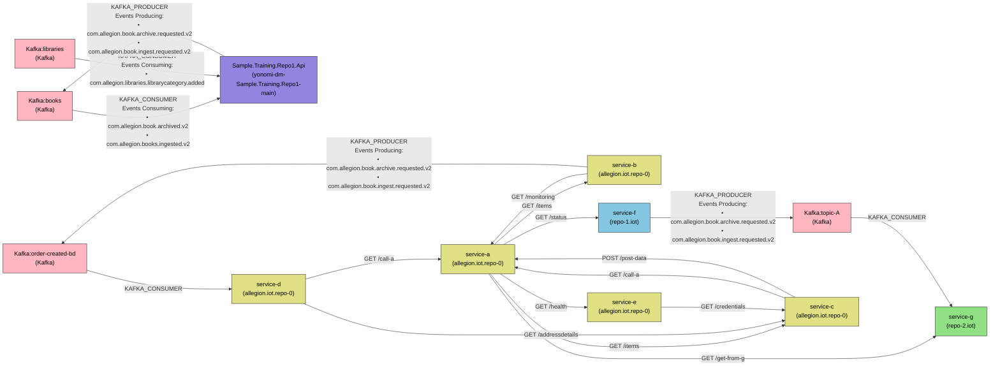

```mermaid
graph LR
classDef Kafka fill:#FFB6C1,stroke:#333,color:#000
classDef allegion_iot_repo_0 fill:#E0E084,stroke:#333,color:#000
classDef repo_1_iot fill:#84C5E0,stroke:#333,color:#000
classDef repo_2_iot fill:#90E084,stroke:#333,color:#000
classDef yonomi_dm_Sample_Training_Repo1_main fill:#9384E0,stroke:#333,color:#000

  Kafka_books["Kafka:books
(Kafka)"]
  Kafka_libraries["Kafka:libraries
(Kafka)"]
  Kafka_order_created_bd["Kafka:order-created-bd
(Kafka)"]
  Kafka_topic_A["Kafka:topic-A
(Kafka)"]
  Sample_Training_Repo1_Api["Sample.Training.Repo1.Api
(yonomi-dm-Sample.Training.Repo1-main)"]
  service_a["service-a
(allegion.iot.repo-0)"]
  service_b["service-b
(allegion.iot.repo-0)"]
  service_c["service-c
(allegion.iot.repo-0)"]
  service_d["service-d
(allegion.iot.repo-0)"]
  service_e["service-e
(allegion.iot.repo-0)"]
  service_f["service-f
(repo-1.iot)"]
  service_g["service-g
(repo-2.iot)"]

  service_a -->|GET /items| service_b
  service_a -->|GET /items| service_c
  service_a -->|GET /health| service_e
  service_a -->|GET /get-from-g| service_g
  service_a -->|GET /status| service_f
  service_b -->|GET /monitoring| service_a
  service_c -->|GET /call-a| service_a
  service_c -->|POST /post-data| service_a
  service_d -->|GET /call-a| service_a
  service_d -->|GET /addressdetails| service_c
  service_e -->|GET /credentials| service_c
  service_b -->|"KAFKA_PRODUCER<br/>Events Producing:<br/>• com.allegion.book.archive.requested.v2<br/>• com.allegion.book.ingest.requested.v2"| Kafka_order_created_bd
  Kafka_order_created_bd -->|"KAFKA_CONSUMER"| service_d
  service_f -->|"KAFKA_PRODUCER<br/>Events Producing:<br/>• com.allegion.book.archive.requested.v2<br/>• com.allegion.book.ingest.requested.v2"| Kafka_topic_A
  Kafka_topic_A -->|"KAFKA_CONSUMER"| service_g
  Kafka_books -->|"KAFKA_CONSUMER<br/>Events Consuming:<br/>• com.allegion.book.archived.v2<br/>• com.allegion.books.ingested.v2"| Sample_Training_Repo1_Api
  Kafka_libraries -->|"KAFKA_CONSUMER<br/>Events Consuming:<br/>• com.allegion.libraries.librarycategory.added"| Sample_Training_Repo1_Api
  Sample_Training_Repo1_Api -->|"KAFKA_PRODUCER<br/>Events Producing:<br/>• com.allegion.book.archive.requested.v2<br/>• com.allegion.book.ingest.requested.v2"| Kafka_books

class Kafka_books,Kafka_libraries,Kafka_order_created_bd,Kafka_topic_A Kafka
class service_a,service_b,service_c,service_d,service_e allegion_iot_repo_0
class service_f repo_1_iot
class service_g repo_2_iot
class Sample_Training_Repo1_Api yonomi_dm_Sample_Training_Repo1_main
```